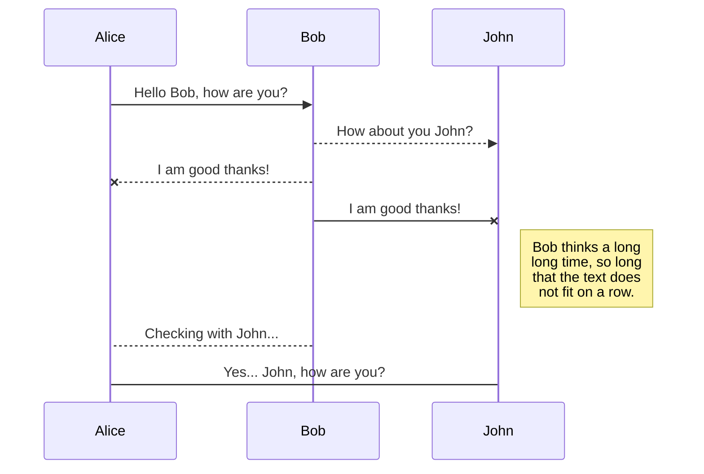
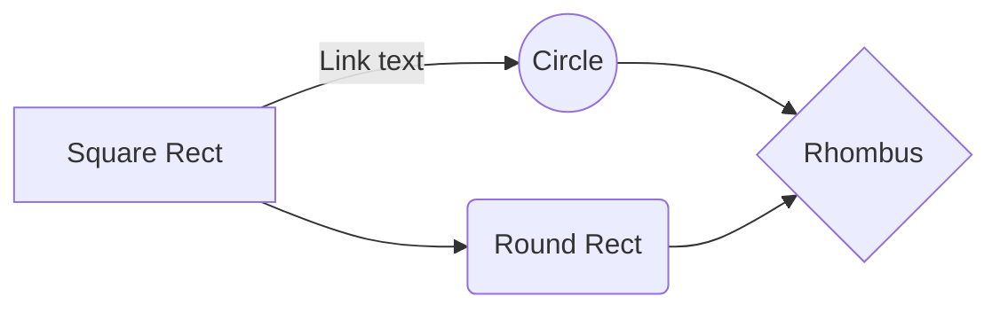

# Night Owl Contract Design

This document provides detailed description of the Ergoscript used to support the Night Owl Platform. 


# Requirements

The Night Owl Platform requires the following functionality:

 - A swapping mechanism for users to swap between sigUSD and OWL tokens (to be extended to any stable-token)
 - A liquidity pool for users to provide capital for the house.
 - For custom casino games to be created that can utilise this stored capital.

## Swapping Mechanism

The swapping mechanism described in the requirements can be implemented in Ergoscript. 
We propose the following design:

At launch, Night Owl casino mints an sufficiently large quantity of OWL tokens and stores them in a UTXO box. Users can interact with this box by providing sigUSD and obtaining released OWL tokens at a 1:1 ratio. The box should have a guard script that enforces the following behaviour:

 - The box is used as an input for a transaction alongside some other inputs containing x sigUSD or OWL. 
 - A new box will be created with the same guard script as our input box that contains:
	 - Initial amount of OWLs +- x
	 - Initial amount of sigUSD -+ x

The ErgoScript which achieves this is below:
```scala
{
val contractTokensOwl = SELF.tokens(0)._2
val contractTokensSigUSD = SELF.tokens(1)._2
val owlId = fromBase58("CqK3dmwgkK83qVnHrc8YLpm46t5aDLWNViwrhmtLqPeh")
val sigUsdId = fromBase58("B9XWSU56ob1S5JPrEHPE5PcWg2HE73AsFBPAYLXXWc7v")
val tokenAmount = OUTPUTS(0).R4[Long].get
val tokenType = OUTPUTS(0).R5[Coll[Byte]].get

// Swap SigUSD for OWL
val swapContract = if (tokenType == owlId) {        
allOf(Coll(
OUTPUTS(0).tokens(0)._1 == owlId,
OUTPUTS(0).tokens(0)._2 == tokenAmount,
OUTPUTS(1).tokens(0)._1 == owlId,
OUTPUTS(1).tokens(0)._2 == contractTokensOwl - tokenAmount,
OUTPUTS(1).tokens(1)._1 == sigUsdId,
OUTPUTS(1).tokens(1)._2 == contractTokensSigUSD + tokenAmount,
OUTPUTS(1).propositionBytes == SELF.propositionBytes))
} else {
// Swap OWL for SigUSD
allOf(Coll(
tokenType == sigUsdId,                      
OUTPUTS(0).tokens(0)._1 == sigUsdId,
OUTPUTS(0).tokens(0)._2 == tokenAmount,
OUTPUTS(1).tokens(0)._1 == owlId,
OUTPUTS(1).tokens(0)._2 == contractTokensOwl + tokenAmount,
OUTPUTS(1).tokens(1)._1 == sigUsdId,
OUTPUTS(1).tokens(1)._2 == contractTokensSigUSD - tokenAmount,
OUTPUTS(1).propositionBytes == SELF.propositionBytes))
}

sigmaProp(swapContract)
}
```

 *Remarks*:

 - The user must inform the script of their 'x' in R4, which represents the number of tokens they are offering for the swap. The user must also inform the script of the token type they are offering in R5. 
 - Notice that if the user attempts to deceive the contract by supplying a false R4 or R5 the INPUTS and OUTPUTS token quantity will not be equal and thus the transaction will be illegal.
 - The arbitarily large amount of minted OWLs must be so large that it is impossible for the contract to ever run out of OWLs. 
 - There is only one UTXO containing all the OWLs and held sigUSD.
 - OUTPUTS(0).propositionBytes is not defined and thus can be set as an ErgoMixer address to allow users to gamble with tokens that have been run through the mixer for additional privacy.


## Liquidity Pool
The liquidity pool acts as the casino's source of capital or bank balance, if you like. Any user with OWLs can provide these tokens as liquidity. All winning bets in the casino are paid from the liquidity pool and a proportion of all losing bets and service fees (for player vs player games) are collected by the liquidity pool. The casino games are designed to produce capital for the pool over time, liquidity providers can capture this produced capital when they redeem their liquidity position. 

Thus, the liquidity pool requires the following functionality:

 - Users can provide and redeem liquidity
 - Redemption of liquidity should give the user their proportion of the tokens in the pool
 - The pool's funds can be used to fund casino games
 
We will leave discussion of this last point for the custom games section.
We propose the following design:

A sufficiently large quantity of LP tokens are minted at the launch of Night Owl. These tokens are stored in a box guarded by the liquidity pool contract. These LP tokens have no function or utility other than to act as a measure of a user's share in the liquidity pool. When a user provides OWL tokens to the pool they receive LP tokens in a 1:1 ratio. When a user redeems their LP tokens they receive:
Formula for OWL  OWL tokens
The contract describing this is as follow:

```scala
{ // LIQUIDITY CONTRACT
val contractTokensOwl = SELF.tokens(0)._2
val contractTokensLP = SELF.tokens(1)._2
val owlId = fromBase58("CqK3dmwgkK83qVnHrc8YLpm46t5aDLWNViwrhmtLqPeh")
val lpId = fromBase58("B9XWSU56ob1S5JPrEHPE5PcWg2HE73AsFBPAYLXXWc7v")
val maxLpValue = 10000000000000000L // some sufficiently large value
val tokenAmount = OUTPUTS(0).R4[Long].get
val tokenType = OUTPUTS(0).R5[Coll[Byte]].get

// OWL for LP
val liquditySwap = if (tokenType == owlId) { 
allOf(Coll(
OUTPUTS(0).tokens(0)._1 == lpId,
OUTPUTS(0).tokens(0)._2 == tokenAmount,
OUTPUTS(1).tokens(0)._1 == owlId,
OUTPUTS(1).tokens(0)._2 == contractTokensOwl + tokenAmount,
OUTPUTS(1).tokens(1)._1 == lpId,
OUTPUTS(1).tokens(1)._2 == contractTokensLP - tokenAmount,
OUTPUTS(1).propositionBytes == SELF.propositionBytes))
} else {
// LP for Owl
allOf(Coll(
tokenType == lpId,
OUTPUTS(0).tokens(0)._1 == owlId,
OUTPUTS(0).tokens(0)._2 == tokenAmount /(maxLpValue - contractTokensLP) * contractTokensOwl,
OUTPUTS(1).tokens(0)._1 == owlId,
OUTPUTS(1).tokens(0)._2 == contractTokensOwl - (tokenAmount /(maxLpValue - contractTokensLP) * contractTokensOwl),
OUTPUTS(1).tokens(1)._1 == lpId,
OUTPUTS(1).tokens(1)._2 == contractTokensLP + tokenAmount,
OUTPUTS(1).propositionBytes == SELF.propositionBytes))
}
sigmaProp(liquditySwap)
}
```

 *Remarks*:

 - Similar to the swap contract, the user proposes the token amount to be swapped in R4 and the token type in R5 and once again cannot cheat the contract due to conservation of tokens
 - The sufficiently large amount of minted LPs is used to reference the number of circulating LPs and thus give an accurate pool share proportion
 - There will be only one UTXO that contains LP tokens. 
 - Division by 0 is impossible since a LP:OWL means there is always some circulating LP. 
All your files and folders are presented as a tree in the file explorer. You can switch from one to another by clicking a file in the tree.

## Rename a file

You can rename the current file by clicking the file name in the navigation bar or by clicking the **Rename** button in the file explorer.

## Delete a file

You can delete the current file by clicking the **Remove** button in the file explorer. The file will be moved into the **Trash** folder and automatically deleted after 7 days of inactivity.

## Export a file

You can export the current file by clicking **Export to disk** in the menu. You can choose to export the file as plain Markdown, as HTML using a Handlebars template or as a PDF.


# Synchronization

Synchronization is one of the biggest features of StackEdit. It enables you to synchronize any file in your workspace with other files stored in your **Google Drive**, your **Dropbox** and your **GitHub** accounts. This allows you to keep writing on other devices, collaborate with people you share the file with, integrate easily into your workflow... The synchronization mechanism takes place every minute in the background, downloading, merging, and uploading file modifications.

There are two types of synchronization and they can complement each other:

- The workspace synchronization will sync all your files, folders and settings automatically. This will allow you to fetch your workspace on any other device.
	> To start syncing your workspace, just sign in with Google in the menu.

- The file synchronization will keep one file of the workspace synced with one or multiple files in **Google Drive**, **Dropbox** or **GitHub**.
	> Before starting to sync files, you must link an account in the **Synchronize** sub-menu.

## Open a file

You can open a file from **Google Drive**, **Dropbox** or **GitHub** by opening the **Synchronize** sub-menu and clicking **Open from**. Once opened in the workspace, any modification in the file will be automatically synced.

## Save a file

You can save any file of the workspace to **Google Drive**, **Dropbox** or **GitHub** by opening the **Synchronize** sub-menu and clicking **Save on**. Even if a file in the workspace is already synced, you can save it to another location. StackEdit can sync one file with multiple locations and accounts.

## Synchronize a file

Once your file is linked to a synchronized location, StackEdit will periodically synchronize it by downloading/uploading any modification. A merge will be performed if necessary and conflicts will be resolved.

If you just have modified your file and you want to force syncing, click the **Synchronize now** button in the navigation bar.

> **Note:** The **Synchronize now** button is disabled if you have no file to synchronize.

## Manage file synchronization

Since one file can be synced with multiple locations, you can list and manage synchronized locations by clicking **File synchronization** in the **Synchronize** sub-menu. This allows you to list and remove synchronized locations that are linked to your file.


# Publication

Publishing in StackEdit makes it simple for you to publish online your files. Once you're happy with a file, you can publish it to different hosting platforms like **Blogger**, **Dropbox**, **Gist**, **GitHub**, **Google Drive**, **WordPress** and **Zendesk**. With [Handlebars templates](http://handlebarsjs.com/), you have full control over what you export.

> Before starting to publish, you must link an account in the **Publish** sub-menu.

## Publish a File

You can publish your file by opening the **Publish** sub-menu and by clicking **Publish to**. For some locations, you can choose between the following formats:

- Markdown: publish the Markdown text on a website that can interpret it (**GitHub** for instance),
- HTML: publish the file converted to HTML via a Handlebars template (on a blog for example).

## Update a publication

After publishing, StackEdit keeps your file linked to that publication which makes it easy for you to re-publish it. Once you have modified your file and you want to update your publication, click on the **Publish now** button in the navigation bar.

> **Note:** The **Publish now** button is disabled if your file has not been published yet.

## Manage file publication

Since one file can be published to multiple locations, you can list and manage publish locations by clicking **File publication** in the **Publish** sub-menu. This allows you to list and remove publication locations that are linked to your file.


# Markdown extensions

StackEdit extends the standard Markdown syntax by adding extra **Markdown extensions**, providing you with some nice features.

> **ProTip:** You can disable any **Markdown extension** in the **File properties** dialog.


## SmartyPants

SmartyPants converts ASCII punctuation characters into "smart" typographic punctuation HTML entities. For example:

|                |ASCII                          |HTML                         |
|----------------|-------------------------------|-----------------------------|
|Single backticks|`'Isn't this fun?'`            |'Isn't this fun?'            |
|Quotes          |`"Isn't this fun?"`            |"Isn't this fun?"            |
|Dashes          |`-- is en-dash, --- is em-dash`|-- is en-dash, --- is em-dash|


## KaTeX

You can render LaTeX mathematical expressions using [KaTeX](https://khan.github.io/KaTeX/):

The *Gamma function* satisfying $\Gamma(n) = (n-1)!\quad\forall n\in\mathbb N$ is via the Euler integral

$$
\Gamma(z) = \int_0^\infty t^{z-1}e^{-t}dt\,.
$$

> You can find more information about **LaTeX** mathematical expressions [here](http://meta.math.stackexchange.com/questions/5020/mathjax-basic-tutorial-and-quick-reference).


## UML diagrams

You can render UML diagrams using [Mermaid](https://mermaidjs.github.io/). For example, this will produce a sequence diagram:



And this will produce a flow chart:


